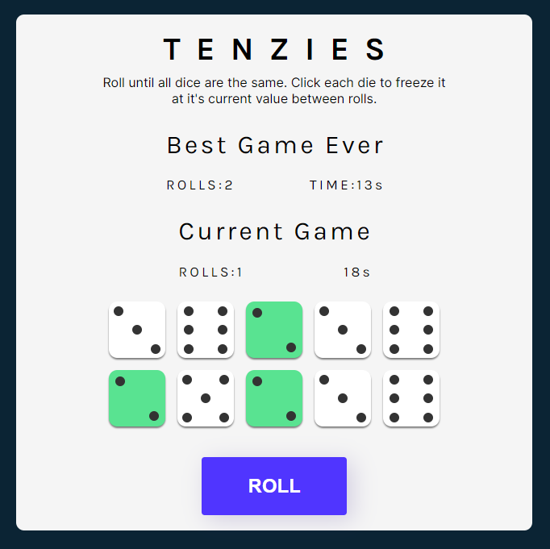

# `TENZIES`

### `A fun and easy game to ` [PLAY](https://adrianpopan-tenzies.netlify.app/)



The game will save your best roll count and also show you the current game roll.


Clone the project and enjoy or click [HERE](https://adrianpopan-tenzies.netlify.app/) if you just want to play.

```
npm start
```

Runs the app in the development mode.\
Open [http://localhost:3000](http://localhost:3000) to view it in your browser.

The page will reload when you make changes.\
You may also see any lint errors in the console.


### `Deployment status:`

[](https://app.netlify.com/sites/adrianpopan-tenzies/deploys)